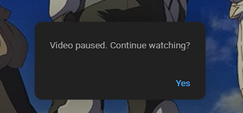

# 📺 YouTube Autopause Bypass for Chrome
Automatically dismisses YouTube’s “Video paused in Google Chrome. Continue watching?” popup, so you can keep background windows playing without interruption.

Just make sure, you run YouTube in a separate window, as using a background tab in the same browser won't work.

## 🚀 Features
- Detects and auto-clicks the "Yes" button in the autoplay pause popup.
- Uses a human-like random delay to avoid detection.
- Ignores invisible buttons or re-clicking.
- Lightweight — no background scripts or network use.

## 🔧 Installation (Developer Mode)
1. Clone or download this repo.
2. Open Chrome and go to `chrome://extensions/.`
3. Enable Developer mode (top-right toggle).
4. Click Load unpacked and select the folder with this extension.
5. Open YouTube in a tab and wait for the popup — it will be auto-dismissed!

## 🧠 How It Works
A content.js script runs on all YouTube pages. It observes the DOM for changes and looks for a button labeled "Yes". When found, it waits ~400–900ms and simulates a full click sequence (mouseover, mousedown, mouseup, click). The popup goes away — and your video keeps playing 🎵

## 🔐 Permissions
`https://www.youtube.com/*`: Needed to run the script on YouTube.

No data is sent, stored, or tracked.

## 🛠 Troubleshooting
Refresh YouTube tabs after installing.

Check DevTools console for:
- "YouTube Autopause Bypass content script loaded."
- "YouTube pause popup detected. Dismissing in ..."

Popup still appears? YouTube may have changed the DOM — update the selector or contact me.